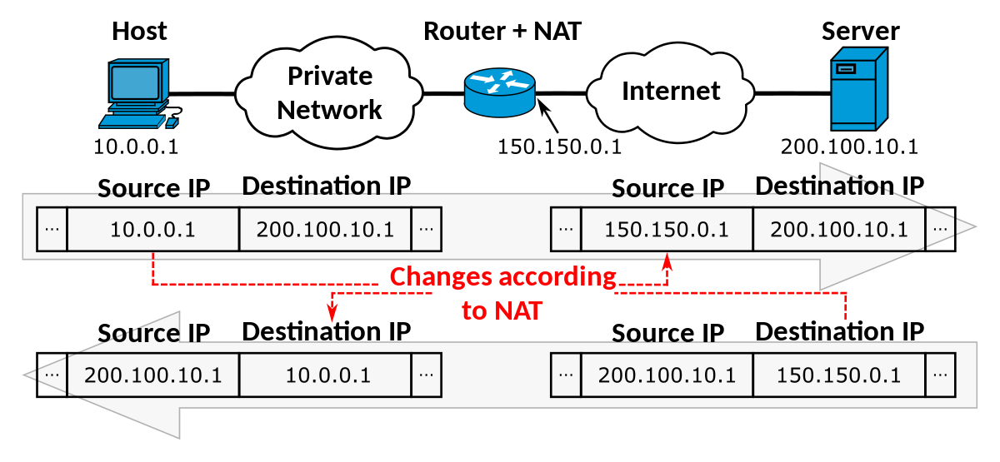

Based on [playlist](https://www.youtube.com/playlist?list=PLqKkf220xDDbW9G0a4XXO50yvHWFq2uOD)

# 1. Installing kvm
[video](https://youtu.be/vyLNpPY-Je0)

```bash
# Confirm, that there is virtualization support on your platform
lscpu | grep Virtualization

sudo apt install qemu-kvm
sudo apt install libvirt-daemon-system libvirt-clients

sudo adduser $USER kvm

# [optional] gui
sudo apt install virt-manager
```

# 2. bridge & NAT networking
[video](ihttps://youtu.be/DYpaX4BnNlg)

## 2.1 NAT
NAT - when guest cannot access the local network of the host machine, it can
only access the internet through NAT (address translation happens on the host
machine, not on the router).



Let's look, how the network interfaces look on host (`ip addr`). Default network
configuration is the following:

- virt-manager acts as a virtual router with NAT enabled
- all guests reside in the same local network under this router (see `ip addr`
  output to determine the local IP), and can see each other
- physical host is not visible in this virtual network and is unreachable from
  guests. And vice-versa: host cannot reach the virtual network
- `virbr0` device stands for *VIRtual BRidge number 0* a.k.a. virtual switch.
  `virbr0-nic` - is just a virtual network card (Network Interface Controller),
  which is connected to this bridge.
- for each VM we will see `vnet0`...`vnetN` - these are virtual NICs of each
  guest

Now, let's look at brctl:
```bash
sudo apt install bridge-utils

brctl show
```
We will see that all the VMs can see each other since they connect to the same
virtual bridge virbr0. If we want the guests to not see each other, we can put
them in different networks.

Okay, but what if we want the host and guest to see each other...

## 2.2 Bridged networks
**Warning**: bridging with wireless connection is way more complicated than with
ethernet cable. See [this reddit
post](https://www.reddit.com/r/linuxquestions/comments/1ezel5i/trying_to_bridge_a_virtual_machine_to_a_wireless/)
and the linked [solution](https://hacktivate.it/posts/kvm-bridge-wireless/)

Unlike NAT, with bridged network we don't have a virtual router. Instead, we use
a virtual switch, to which we connect all the guests and the host. The result is
following:

- Each guest is seen as a separate machine on our home router LAN
- each guest receives its IP via DHCP from the home router
- host is still seen as a separate machine on LAN with its own IP leased via
  DHCP

The bridge network can be configured via nmtui: [timecode](https://youtu.be/DYpaX4BnNlg?t=546)

## Further reading
- [NIC](https://docs.redhat.com/en/documentation/red_hat_virtualization/4.4/html/technical_reference/network_interface_controller_nic) (rhel)
- [Qemu network setup](https://wiki.qemu.org/Documentation/Networking)

# 3. Snapshots
[video](https://youtu.be/1SDvth66i-4)

UEFI-based VM snapshots work out of the box, they are called *external
snapshots* and are designed akin to git commits: we only store an image delta and need
all of the intermediate deltas to be present.

For BIOS-based VMs though, to create snapshots, you'll have to switch loader
type from `pflash` to `rom`. If you then want your VM to boot, the loader will
have to be switched back to `pflash`. This type of snapshotting technique is
call *internal snapshots*.

On one hand, internal snapshots may take a lot of memory. On the other hand,
external snapshots need to have the base image ("backing store") and all of the
intermediate deltas present, making this approach fault intollerant.


