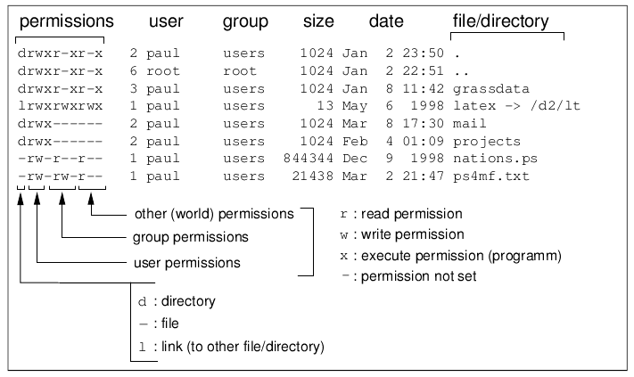

Usefull links:

- [Advanced bash scripting](https://youtu.be/uqHjc7hlqd0) and the whole
  [playlist](https://www.youtube.com/playlist?list=PLz0NfPpvHdPEmRWIN06SO_lRv-THMfr-R)

# Lecture 2
- TLPI Ch. 14-15
- [inodes in ext4](https://www.kernel.org/doc/html/latest/filesystems/ext4/inodes.html)
- [netcat](https://linux.die.net/man/1/nc)
- [dd](https://linux.die.net/man/1/dd)
- [ln](https://linux.die.net/man/1/ln)
- [chmod](https://linux.die.net/man/1/chmod)
- [chown](https://linux.die.net/man/1/chown)

- inode (index node, индексный дескриптор) - не зависящая от файловой ситсемы сущность
- hard link - это ассоциация пути в файловой системе c inode. По сути `Map<Path, INode>`
- хардлинки запрещено делать между ФС (нельзя сделать из /home в /var/log)
- разные маунты ФС имеют разную нумерацию inode-ов

Посмотрим на пример вывода команды stat:
```
$ stat README.md
  File: README.md
  Size: 22              Blocks: 8          IO Block: 4096   regular file
Device: 259,2   Inode: 3161481     Links: 1 Access: (0644/-rw-r--r--)  Uid: ( 1000/   ahmad)   Gid: ( 1000/   ahmad)
Access: 2025-09-24 23:12:03.450097612 +0300
Modify: 2025-09-21 18:50:09.736830287 +0300 Change: 2025-09-21 18:50:09.736830287 +0300
 Birth: 2025-09-21 18:50:09.736830287 +0300
```
`Links` - количество жестких ссылок на и-ноду.
Можно попытаться с помощью команды `find ... -inum N` найти все файлы,
ссылающиеся на и-ноду N:
```
$ find . -inum 3161481
./README.md
$ ln README.md readme2
$ find . -inum 3161481
./readme2
./README.md
```
Кстати, хардлинки разрешены для директорий, но только под рутом, чтобы случайно
не создать цикл из ссылок:
```
(из man ln)
       -d, -F, --directory
              allow the superuser to attempt to hard link directories (note:
              will probably fail due to system restrictions, even for the
              superuser)
```

- soft link (символическая ссылка) - `Map<Path, Path>`

Преимущество симфолической ссылки в том, что они могут существовать cross-FS,
т.к. пути FS-agnostic

## /dev/
Кастомная ФС под девайсы: запись в файл = запись в девайс, чтение файла = чтение
из девайса.

- /dev/null - устройство в которое можно бесконечно писать че угодно без
  какого-либо эффекта. Пример `./command 2>/dev/null`
- `/dev/random`/`/dev/urandom` - можно читать случайный поток байт
- `/dev/zero` - можно читать и получать бесконечный поток нулевых байтов
- `/dev/ttyN` - виртуальные консоли, туда можно писать
- `/dev/console` - не понял,
  [SO](https://unix.stackexchange.com/questions/485156/what-is-dev-console-used-for)
- `/dev/sd[a-z][0-9]*` - это файлы-дырки, которые являются интерфейсом к
  SATA-based дискам. Номер в конце - номер раздела (партиции) диска.
- `/dev/nvme*` - то же самое для NVME-дисков (подключенные через PCIe а не SATA)
- файловые дырки бывают символьные (c) а бывают блочные (b)

Как разлить по сети образ диска на другой компьютер в локальной сети:
```bash
# transmitter (has address 192.168.0.1)
dd if=/dev/sda | nc -P1234

# receiver
nc 192.168.0.1:1234 | dd of=/dev/sda
```

А что если не хотим разбираться с SIGPIPE и писать signal handler-ы? Тогда можно
заиспользовать именованные каналы - на помощь приходит mkfifo:
```bash
mkfifo ./tx
nc -P1234 <./tx &
dd if=/dev/sda >./tx

# receiver
mkfifo ./rx
nc 192.168.0.1:1234 >./rx &
dd of=/dev/sda <./rx
```
Если бы мы просто сделали touch ./rx, то всё взаимодействие происходило через
диск и мы бы получили оверхерд на запись/чтение с него. Зато именованный канал
работает in-memory.

Разберем вывод `ls -l`:


*Note*: `2` (второе поле) - кол-во жестких ссылок на эту inode

`chmod` - позволяет менять пермишены (первое поле):


`chown` - позволяет менять владельцев и создателей

